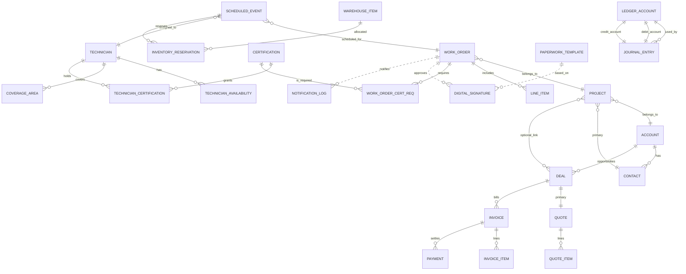

<!-- markdownlint-disable-file -->
# Task Research Notes: Optimum Core Domain Relationships for FSM/CRM/Bookkeeping

## Research Executed

### File Analysis
- main/models.py
  - CRM: Account, Contact, Deal (Opportunity), Quote, QuoteItem, Invoice, InvoiceItem, Payment
  - FSM: Project, WorkOrder, LineItem, Technician, Certification, TechnicianCertification, CoverageArea, TechnicianAvailability, ScheduledEvent, InventoryReservation, NotificationLog, DigitalSignature, PaperworkTemplate, AppointmentRequest, SchedulingAnalytics
  - Accounting: LedgerAccount (chart of accounts), JournalEntry (double-entry), Budget, Expense
- spec/spec-design-master.md
  - Canonical API sections for CRM, Technician/User Management, Field Service; acceptance mapping; ER diagram for work order–centric model

### Code Search Results
- class LedgerAccount|JournalEntry|Invoice|Payment|Quote|Deal|QuoteItem|InvoiceItem
  - Present and linked appropriately (e.g., Invoice -> Deal; InvoiceItem -> Invoice; JournalEntry has debit_account/credit_account)
- Technician|ScheduledEvent|CoverageArea|TechnicianAvailability|Certification
  - Field Service entities and constraints implemented with clear relationships

### External Research
- #fetch:https://learn.microsoft.com/en-us/dynamics365/field-service/overview
  - Confirms FSM core: Work Orders, Scheduling/Dispatch, Inventory, Billing, Time Tracking, Analytics
- #fetch:https://developer.xero.com/documentation/api/accounting/overview
  - Confirms bookkeeping core: Accounts (COA), Journals/JournalLines, Invoices/InvoiceLines, Payments, Tax Rates; double-entry principles
- #fetch:https://learn.microsoft.com/en-us/dynamics365/sales/overview
  - Confirms CRM core: Account, Contact, Opportunity, Quote, Order, Invoice as the standard sales pipeline

### Project Conventions
- Standards referenced: spec sections #architecture, #api-patterns, #field-service-api, #tech-user-api, #accounting-workflow-summary
- Instructions followed: Use repo models and endpoints as primary source of truth; validate with external vendor models (Dynamics, Xero, Dynamics Sales)

## Key Discoveries

### Integrated Domain Layers
1) CRM (sell-to-cash initiation)
   - Account 1:N Contact
   - Account 1:N Deal (Opportunity)
   - Deal 1:1 Quote; Quote 1:N QuoteItem
   - Deal 1:N Invoice; Invoice 1:N InvoiceItem; Payment → Invoice

2) Field Service (deliver service)
   - Project → Account, Contact, Deal (optional)
   - WorkOrder → Project; WorkOrder 1:N LineItem (parts/services)
   - ScheduledEvent → WorkOrder, Technician (recurrence supported)
   - Technician → Availability, CoverageArea; Technician ↔ Certification via TechnicianCertification
   - WorkOrder ↔ Certification via WorkOrderCertificationRequirement
   - InventoryReservation → ScheduledEvent, WarehouseItem (reserve/consume)
   - DigitalSignature → WorkOrder (via PaperworkTemplate); NotificationLog generic to WO/events

3) Bookkeeping (recognize and post)
   - LedgerAccount (COA)
   - JournalEntry (double-entry with debit_account and credit_account)
   - System events post journals:
     - Invoice posting: Dr Accounts Receivable; Cr Revenue (and tax where applicable)
     - Payment receipt: Dr Cash/Bank; Cr Accounts Receivable
     - Inventory consumption: Dr Cost of Goods Sold; Cr Inventory
     - Expense approvals: Dr Expense; Cr Payables/Cash (depending on flow)

### Integration Points (optimum)
- Quote → Deal conversion drives WorkOrder creation when accepted (or downstream Project)
- WorkOrderInvoice aggregates WorkOrder LineItems and labor; Invoices visible in CRM and posted to GL
- Payments settle Invoices and update AR; journal postings are automatic
- Inventory reservations originate from scheduling and are consumed on completion; GL reflects COGS/Inventory movement
- Technician time (TimeEntry) rolls into labor line items or payroll exports; analytics aggregates KPIs

## Complete Examples


### API and Schema Documentation
- CRM endpoints: /api/accounts/, /api/contacts/, /api/deals/, /api/quotes/, /api/quote-items/, /api/invoices/, /api/invoice-items/, /api/payments/
- FSM endpoints: /api/work-orders/, /api/line-items/, /api/scheduled-events/, /api/technicians/, /api/certifications/, /api/technician-availability/, /api/coverage-areas/, /api/inventory-reservations/, notifications and signatures
- Accounting endpoints: /api/ledger-accounts/, /api/journal-entries/, financial reports

### Configuration Examples
```json
{
  "posting_rules": {
    "invoice_post": ["DR:AccountsReceivable", "CR:Revenue"],
    "payment_receive": ["DR:Cash", "CR:AccountsReceivable"],
    "inventory_consume": ["DR:COGS", "CR:Inventory"]
  },
  "scheduling": { "rrule_support": true, "optimize_routes": true },
  "qualification": { "enforce_certifications": true }
}
```

### Technical Requirements
- Enforce double-entry invariants on JournalEntry writes
- Idempotent posting from operational events (invoice post, payment, consumption)
- RBAC across CRM, FSM, and Accounting; audit via ActivityLog and NotificationLog

## Recommended Approach
Optimum core relationships for an integrated FSM/CRM/Bookkeeping suite:

1) CRM backbone: Account, Contact, Deal, Quote(+Items), Invoice(+Items), Payment
2) FSM execution: Project, WorkOrder(+LineItems), ScheduledEvent→Technician, Availability/Coverage, Certifications (+requirements), InventoryReservation, DigitalSignature, NotificationLog
3) Bookkeeping core: LedgerAccount (COA), JournalEntry (double-entry)
4) Integrations: Event-driven postings; invoice generation from WorkOrders; inventory consumption on completion; payments applied to invoices; analytics snapshots

## Implementation Guidance
- **Objectives**: Unified quote→order→delivery→invoice→payment→post; dispatch respects constraints; inventory and accounting remain accurate in real time.
- **Key Tasks**: Wire posting rules; ensure WorkOrder↔Invoice mapping; enforce assignment constraints; implement reservation→consumption; add acceptance tests for postings.
- **Dependencies**: Existing models in main/models.py; API endpoints in main/api_urls.py; RBAC and ActivityLog.
- **Success Criteria**: End-to-end flows produce correct GL postings, satisfied scheduling constraints, accurate inventory levels, and traceable customer communication/approvals.

---

Note on alternatives: All non-selected approaches have been removed. This research document is locked to the single recommended approach above per requirements.

## Spec Insertion: Acceptance Criteria for GL Postings (Ready-to-Apply)

Use the following acceptance criteria in `spec/spec-design-master.md` under the Acceptance Mapping section. Anchor IDs are included for cross-linking.

### Accounting Posting Acceptance Criteria {#ac-gl}

- AC-GL-001 Invoice Posting → Journal Entry
  - Preconditions: A posted Invoice exists with one or more InvoiceItems and valid LedgerAccount mappings for Accounts Receivable and Revenue (and Tax if applicable).
  - Action: POST /api/invoices/{id}/post/ or equivalent posting action.
  - Expected:
    - Creates a JournalEntry with two or more lines obeying double-entry invariants:
      - DR AccountsReceivable = invoice.total_gross
      - CR Revenue = invoice.total_net
      - If tax applicable: CR TaxPayable = invoice.total_tax
    - Idempotency: Re-posting the same invoice does not create duplicate JournalEntries.
    - Invoice status transitions to Posted; AR balance reflects the invoice total.
    - Audit: ActivityLog records the posting event with user and invoice reference.
    - Error modes: Missing COA mapping → 400 with explicit field; Already posted → 409.

- AC-GL-002 Payment Receipt → Journal Entry and AR Settlement
  - Preconditions: A Posted Invoice with open balance; a valid Cash/Bank LedgerAccount mapping.
  - Action: POST /api/payments/ with invoice reference and amount (supports partial payments).
  - Expected:
    - Creates a JournalEntry:
      - DR Cash/Bank = payment.amount
      - CR AccountsReceivable = payment.amount
    - Applies payment to the referenced Invoice, reducing its balance; status transitions to Paid when balance == 0.
    - Partial payments: Invoice status transitions to Partially Paid; remaining balance accurate.
    - Idempotency: Retrying the same payment reference doesn’t double-apply.
    - Validation: Reject overpayment (amount > open balance) with 400.
    - Audit: ActivityLog records payment creation and application.

- AC-GL-003 Inventory Consumption on Work Order Completion → Journal Entry
  - Preconditions: WorkOrder with consumed LineItems that reference WarehouseItem with unit_cost > 0; valid Inventory and COGS LedgerAccount mappings; sufficient stock.
  - Action: PATCH /api/work-orders/{id}/complete/ or completion event that triggers consumption.
  - Expected:
    - For each consumed part line: decrements WarehouseItem.quantity by line.quantity.
    - Creates a JournalEntry totaling cost:
      - DR CostOfGoodsSold = sum(line.quantity × warehouse_item.unit_cost for part lines)
      - CR Inventory = same amount
    - Prevents negative inventory; returns 409 if insufficient stock unless backorder override is specified.
    - Idempotency: Completing the same WorkOrder twice does not double-consume inventory nor double-post GL.
    - Audit: ActivityLog records consumption and posting; NotificationLog may capture stock alerts.

Implementation note: Map accounts via configuration or model fields; enforce double-entry invariant on JournalEntry writes and provide consistent error semantics (400/409) as specified.
