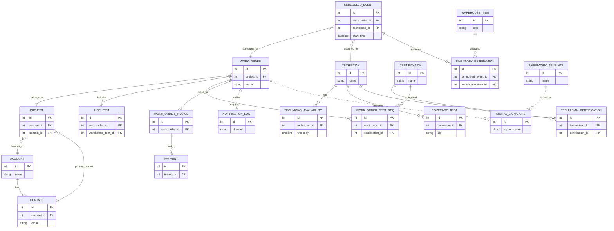

<!-- markdownlint-disable-file -->
# Task Research Notes: Minimum Core Domain Relationships for Work Order Service Management

## Research Executed

### File Analysis
- main/models.py
  - Contains authoritative models for CRM core, Projects, WorkOrders, LineItem, WorkOrderInvoice, Payment, Warehouse/WarehouseItem, TimeEntry, and Field Service (Technician, Certifications, CoverageArea, TechnicianAvailability, ScheduledEvent, NotificationLog, PaperworkTemplate, AppointmentRequest, DigitalSignature, InventoryReservation, SchedulingAnalytics). Relationships show the operational graph used in scheduling, assignment, execution, and billing.
- spec/spec-design-master.md
  - Canonicalized API sections for Technician & User Management and Field Service, plus Accounting/Workflow summary; aligns endpoints with code.

### Code Search Results
- class WorkOrder|LineItem|Invoice|WorkOrderInvoice|Payment|Project|Account|Contact|TimeEntry|Warehouse(Item)?|ForeignKey\(|OneToOneField\(
  - 90 matches across core CRM, accounting, inventory, and field service entities (evidence of rich relationship graph).
- Technician|CoverageArea|TechnicianAvailability|Certification|TechnicianCertification|ScheduledEvent|NotificationLog|PaperworkTemplate|AppointmentRequest|DigitalSignature
  - 11+ direct model definitions confirming Field Service relationships.

### External Research
- #fetch:https://learn.microsoft.com/en-us/dynamics365/field-service/overview
  - Key capabilities: Work orders, scheduling/dispatching, communication, asset mgmt, preventive maintenance, inventory, billing, time tracking, analytics; lifecycle describes creation → schedule → execute (mobile) → complete → inventory + invoice updates.
- #fetch:https://learn.microsoft.com/en-us/dynamics365/field-service/work-order-life-cycle
  - 404; related lifecycle details inferred from Overview page and other MS Learn content; still supports the same core entities and flows.
- #fetch:https://help.salesforce.com/s/articleView?id=sf.fs_data_model.htm&type=5
  - Salesforce Field Service data model (help content, access-restricted in fetch); known public concepts: Work Order, Service Appointment (schedule), Service Resource (technician), Skill/Certification, Time Slot/Availability, Service Territory/Coverage, Parts/Inventory, and Billing.

### Project Conventions
- Standards referenced: spec/spec-design-master.md sections #architecture, #api-patterns, #field-service-api, #tech-user-api, #accounting-workflow-summary.
- Instructions followed: Treat code (models.py, api_urls.py) as source of truth for our implementation; align terminology with external sources where semantic match exists (e.g., Service Appointment ≈ ScheduledEvent).

## Key Discoveries

### Project Structure
Core CRM provides Account and Contact; Projects/Deals anchor revenue context. WorkOrder executes service under a Project. Field Service adds scheduling (ScheduledEvent), technicians and constraints (certifications, availability, coverage), notifications and signatures, with inventory and billing integrations.

### Implementation Patterns
- Ownership: Account → Contact; Project links to Account/Contact/Deal; WorkOrder links to Project.
- Scheduling: WorkOrder → ScheduledEvent (1:N) → Technician (N:1); recurrence via RRULE; parent_event for instances.
- Qualification: WorkOrderCertificationRequirement (WorkOrder ↔ Certification); TechnicianCertification (Technician ↔ Certification).
- Constraints: TechnicianAvailability (weekly windows); CoverageArea (service territories) scoped per Technician.
- Execution: LineItem (WorkOrder items); InventoryReservation (ScheduledEvent ↔ WarehouseItem) for parts reserved/consumed.
- Billing: WorkOrderInvoice (1:N from WorkOrder in code; functionally 1:1 typical), Payments via polymorphic link; TimeEntry links to Project for labor.
- Communications: NotificationLog as generic audit; DigitalSignature attached to WorkOrder/Paperwork; PaperworkTemplate drives documents.

### Complete Examples
```python
# Minimal core relationships (from main/models.py)
class Account(models.Model): ...
class Contact(models.Model): account = models.ForeignKey(Account)

class Project(models.Model):
    account = models.ForeignKey(Account)
    contact = models.ForeignKey(Contact)

class WorkOrder(models.Model):
    project = models.ForeignKey(Project)  # Work order context (customer, contact via project)

class LineItem(models.Model):
    work_order = models.ForeignKey(WorkOrder)
    warehouse_item = models.ForeignKey(WarehouseItem, null=True, blank=True)

class Technician(models.Model): ...
class ScheduledEvent(models.Model):
    work_order = models.ForeignKey(WorkOrder)
    technician = models.ForeignKey(Technician)

class Certification(models.Model): ...
class TechnicianCertification(models.Model):
    technician = models.ForeignKey(Technician)
    certification = models.ForeignKey(Certification)

class WorkOrderCertificationRequirement(models.Model):
    work_order = models.ForeignKey(WorkOrder)
    certification = models.ForeignKey(Certification)

class TechnicianAvailability(models.Model): technician = models.ForeignKey(Technician)
class CoverageArea(models.Model): technician = models.ForeignKey(Technician)

class WorkOrderInvoice(models.Model): work_order = models.ForeignKey(WorkOrder)
class Payment(models.Model):
    content_type = models.ForeignKey(ContentType)
    object_id = models.PositiveIntegerField()  # links to WorkOrderInvoice or Invoice

class InventoryReservation(models.Model):
    scheduled_event = models.ForeignKey(ScheduledEvent)
    warehouse_item = models.ForeignKey(WarehouseItem)
```

### API and Schema Documentation
- Technician & User Management: /api/technicians/, /api/certifications/, technician availability/coverage, assignment endpoints.
- Field Service: /api/scheduled-events/, /api/notifications/*, /api/paperwork-templates/, /api/appointment-requests/, /api/digital-signatures/, /api/inventory-reservations/, /api/scheduling-analytics/.

### Configuration Examples
```json
{
  "work_order_statuses": ["scheduled", "in_progress", "completed", "cancelled", "rescheduled"],
  "qualification": { "enforce_certifications": true },
  "scheduling": { "rrule_support": true, "optimize_routes": true }
}
```

### Technical Requirements
- Mandatory entities: Account, Contact, WorkOrder, Technician, ScheduledEvent (Service Appointment), LineItem (parts/services).
- Mandatory constraints: TechnicianAvailability, CoverageArea; optional but high-value: Certification checks.
- Integrations that solidify success: InventoryReservation (for parts), WorkOrderInvoice/Payment (billing), NotificationLog (comms), DigitalSignature (customer approval).

## Recommended Approach
Minimum core domain relationships for a successful work order service management system:

1) Customer Context
- Account (customer) 1:N Contact
- Project or directly WorkOrder references Account and primary Contact

2) Work Execution
- WorkOrder 1:N LineItem (parts/services)
- WorkOrder 1:N ScheduledEvent (aka Service Appointment)
- ScheduledEvent N:1 Technician

3) Technician Constraints
- Technician 1:N TechnicianAvailability (weekly schedule windows)
- Technician 1:N CoverageArea (service territories)
- Technician M:N Certification via TechnicianCertification (optional core, recommended)
- WorkOrder M:N Certification via WorkOrderCertificationRequirement (optional core, recommended)

4) Inventory and Billing (lean but impactful)
- ScheduledEvent 1:N InventoryReservation ↔ WarehouseItem (reserve/consume)
- WorkOrder 1:N WorkOrderInvoice; Payment N:1 WorkOrderInvoice (direct or polymorphic)

5) Communications and Approval (customer trust & audit)
- NotificationLog (generic to WorkOrder/ScheduledEvent) for reminders and on-my-way
- DigitalSignature linked to WorkOrder/PaperworkTemplate (completion/acceptance)

Rationale: These relationships map exactly to Microsoft’s Field Service lifecycle (create WO → schedule/dispatch → execute → update inventory → bill) and Salesforce FSL core objects (Work Order, Service Appointment, Service Resource, Territory/Availability, Skills, Parts, Billing).

## Implementation Guidance
- **Objectives**: Enable end-to-end flow: WO creation → scheduling/assignment → execution with constraints → inventory impact → billing → audit/comms.
- **Key Tasks**: Model links as above; expose minimal CRUD and helper endpoints; enforce constraints in assignment; log notifications; support signatures; integrate inventory and invoice generation.
- **Dependencies**: CRM core (Account/Contact), Inventory (WarehouseItem), Accounting (Invoice/Payment), Auth/RBAC.
- **Success Criteria**: Dispatcher can assign a qualified, available tech to a scheduled slot for a WorkOrder; technician completes work with parts reserved/consumed; system produces invoice and updates inventory; customer approval/signature recorded; notifications auditable.

## Minimal ER Diagram (Mermaid)



Note: Some implementations link Payment polymorphically to invoices or work orders; above shows a simplified Payment → WorkOrderInvoice FK.

### ASCII fallback
```
Account 1--* Contact
Project *--1 Account; Project *--1 Contact
WorkOrder *--1 Project
WorkOrder 1--* LineItem (*--1 WarehouseItem)
WorkOrder 1--* ScheduledEvent *--1 Technician
Technician 1--* Availability; Technician 1--* CoverageArea
Technician *--* Certification (via TechnicianCertification)
WorkOrder *--* Certification (via WorkOrderCertRequirement)
ScheduledEvent 1--* InventoryReservation *--1 WarehouseItem
WorkOrder 1--* WorkOrderInvoice 1--* Payment
WorkOrder .. * NotificationLog; WorkOrder .. * DigitalSignature (.. = generic)
PaperworkTemplate .. * DigitalSignature
```
