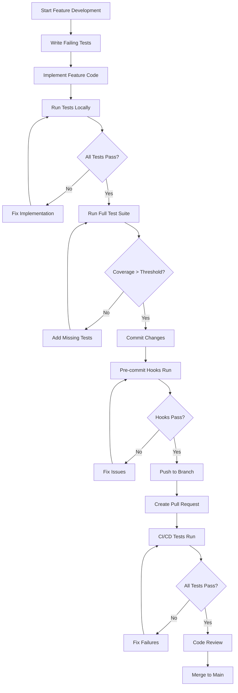

# Frontend Testing Integration & Team Adoption Specification

Comprehensive specification for integrating frontend testing automation into the development workflow, establishing quality gates, and ensuring team-wide adoption of testing best practices.

## 1. Purpose & Scope

This specification defines the integration strategy for the implemented frontend testing automation framework into the Converge CRM development workflow. It covers developer onboarding, CI/CD integration, quality gate enforcement, documentation updates, and team adoption protocols.

**Target Audience**: Development team, DevOps engineers, QA team, project managers
**Implementation Context**: Post-automation implementation phase for production deployment
**Quality Goal**: Achieve 100% team adoption of testing practices with zero production incidents due to untested code

## 2. Definitions

- **Quality Gate**: Automated checkpoint that prevents code progression without meeting defined criteria
- **Test-Driven Development (TDD)**: Development approach where tests are written before implementation
- **Continuous Integration (CI)**: Automated integration and testing of code changes
- **Pull Request (PR) Validation**: Automated testing that runs on code changes before merge
- **Coverage Regression**: Decrease in test coverage compared to previous baseline
- **Flaky Test**: Test that produces inconsistent results without code changes
- **Testing Champions**: Team members who lead testing adoption and provide guidance
- **Quality Metrics**: Measurable indicators of code quality and testing effectiveness

## 3. Requirements, Constraints & Guidelines

### Core Integration Requirements

- **REQ-FTI-001**: All new components must have corresponding test files before PR approval
- **REQ-FTI-002**: Pre-commit hooks must validate test coverage and prevent commits below threshold
- **REQ-FTI-003**: CI/CD pipeline must execute full test suite on every pull request
- **REQ-FTI-004**: Test failures must block deployment to staging and production environments
- **REQ-FTI-005**: Coverage reports must be generated and published for every build
- **REQ-FTI-006**: All team members must complete testing framework training within 2 weeks
- **REQ-FTI-007**: Testing documentation must be updated within 24 hours of framework changes

### Team Adoption Requirements

- **REQ-FTI-008**: 100% of frontend developers must use testing framework for new features
- **REQ-FTI-009**: Code reviews must include test quality assessment checklist
- **REQ-FTI-010**: Monthly testing metrics must be reviewed and communicated to stakeholders
- **REQ-FTI-011**: Testing best practices must be documented and accessible to all team members
- **REQ-FTI-012**: Testing Champions must provide weekly office hours for team support

### CI/CD Integration Requirements

- **REQ-FTI-013**: GitHub Actions workflow must include frontend testing stages
- **REQ-FTI-014**: Test results must be reported in PR comments with coverage diff
- **REQ-FTI-015**: Failed tests must provide actionable error messages and debugging links
- **REQ-FTI-016**: Performance regression alerts must be sent to development team
- **REQ-FTI-017**: Accessibility violations must block PR merge with detailed violation reports

### Documentation Requirements

- **REQ-FTI-018**: All project documentation must reflect testing integration requirements
- **REQ-FTI-019**: Developer onboarding guide must include comprehensive testing walkthrough
- **REQ-FTI-020**: Architecture documentation must include testing strategy decisions
- **REQ-FTI-021**: API documentation must include frontend testing examples
- **REQ-FTI-022**: Deployment documentation must include testing validation steps

### Constraints

- **CON-FTI-001**: CI/CD pipeline execution time must not exceed 15 minutes total
- **CON-FTI-002**: Testing framework must not impact local development performance
- **CON-FTI-003**: All testing tools must be compatible with existing development environment
- **CON-FTI-004**: Testing adoption must not reduce development velocity beyond 20%
- **CON-FTI-005**: Testing infrastructure costs must remain within allocated budget

### Guidelines

- **GUD-FTI-001**: Follow "Test First" approach for all new feature development
- **GUD-FTI-002**: Maintain test-to-code ratio of at least 1:2 (lines of test code to implementation)
- **GUD-FTI-003**: Use descriptive test names that clearly communicate intent and expected behavior
- **GUD-FTI-004**: Group related tests using describe blocks with clear contextual hierarchy
- **GUD-FTI-005**: Write tests that validate user behavior, not implementation details

## 4. Team Development Workflow Integration

### Developer Onboarding Process

#### Phase 1: Framework Familiarization (Days 1-3)
1. **Testing Environment Setup**
   ```bash
   # Developer setup checklist
   git clone repository
   npm install
   npm run test:setup-environment
   npm run test -- --watch  # Verify test runner works
   ```

2. **Hands-on Testing Tutorial**
   - Complete interactive testing tutorial using existing test examples
   - Write first component test with mentorship from Testing Champion
   - Submit practice PR with test coverage validation

3. **Quality Gate Understanding**
   - Review quality gate requirements and failure scenarios
   - Practice fixing failing tests and coverage issues
   - Understand CI/CD pipeline integration points

#### Phase 2: Practical Application (Days 4-7)
1. **Feature Development with TDD**
   - Select small feature for TDD implementation
   - Write tests first, then implement feature
   - Submit for code review with testing focus

2. **E2E Test Creation**
   - Create E2E test for feature using Cypress
   - Understand Page Object Model patterns
   - Practice debugging E2E failures

#### Phase 3: Advanced Testing Patterns (Days 8-14)
1. **Complex Component Testing**
   - Test components with multiple dependencies
   - Practice mocking strategies with MSW
   - Write accessibility and performance tests

2. **Testing Mentorship**
   - Shadow experienced developer for complex testing scenarios
   - Lead testing discussion in team code review
   - Contribute to testing documentation improvements

### Daily Development Workflow



### Code Review Integration

#### Testing Checklist for Reviewers
- [ ] **Test Coverage**: New code has corresponding tests with >85% coverage
- [ ] **Test Quality**: Tests validate user behavior and edge cases
- [ ] **Test Maintainability**: Tests are readable and use appropriate abstractions
- [ ] **Mock Usage**: External dependencies are properly mocked
- [ ] **E2E Coverage**: Critical user workflows have E2E test coverage
- [ ] **Accessibility**: Components pass accessibility validation
- [ ] **Performance**: No performance regression detected
- [ ] **Documentation**: Test changes are documented appropriately

#### Automated PR Validation

```yaml
# GitHub Actions PR Validation
name: Frontend Testing Validation
on:
  pull_request:
    paths: ['frontend/**']

jobs:
  test-validation:
    runs-on: ubuntu-latest
    steps:
      - name: Checkout Code
        uses: actions/checkout@v4

      - name: Setup Node.js
        uses: actions/setup-node@v4
        with:
          node-version: '18'
          cache: 'npm'

      - name: Install Dependencies
        run: cd frontend && npm ci

      - name: Run Unit Tests
        run: cd frontend && npm run test:ci

      - name: Check Coverage Threshold
        run: cd frontend && npm run test:coverage-check

      - name: Run E2E Tests
        run: cd frontend && npm run test:e2e:ci

      - name: Run Accessibility Tests
        run: cd frontend && npm run test:a11y

      - name: Run Performance Tests
        run: cd frontend && npm run test:performance

      - name: Generate Test Report
        run: cd frontend && npm run test:report

      - name: Comment PR with Results
        uses: actions/github-script@v7
        with:
          script: |
            const fs = require('fs');
            const report = fs.readFileSync('frontend/test-report.json', 'utf8');
            const results = JSON.parse(report);

            github.rest.issues.createComment({
              issue_number: context.issue.number,
              owner: context.repo.owner,
              repo: context.repo.repo,
              body: `## 🧪 Test Results

              **Coverage**: ${results.coverage}%
              **Unit Tests**: ${results.unitTests.passed}/${results.unitTests.total} passed
              **E2E Tests**: ${results.e2eTests.passed}/${results.e2eTests.total} passed
              **Accessibility**: ${results.accessibility.violations} violations
              **Performance**: ${results.performance.score}/100

              ${results.coverage < 85 ? '❌ Coverage below threshold (85%)' : '✅ Coverage meets threshold'}
              ${results.accessibility.violations > 0 ? '❌ Accessibility violations detected' : '✅ No accessibility issues'}
              ${results.performance.score < 90 ? '❌ Performance below threshold (90)' : '✅ Performance meets standards'}
              `
            });
```

## 5. CI/CD Pipeline Integration

### Complete GitHub Actions Workflow

```yaml
name: Converge CRM - Frontend Quality Pipeline
on:
  push:
    branches: [main, develop]
    paths: ['frontend/**']
  pull_request:
    branches: [main, develop]
    paths: ['frontend/**']

env:
  NODE_VERSION: '18'
  COVERAGE_THRESHOLD: 85
  PERFORMANCE_THRESHOLD: 90

jobs:
  # Job 1: Code Quality & Linting
  code-quality:
    name: Code Quality Check
    runs-on: ubuntu-latest
    steps:
      - uses: actions/checkout@v4
      - uses: actions/setup-node@v4
        with:
          node-version: ${{ env.NODE_VERSION }}
          cache: 'npm'
          cache-dependency-path: 'frontend/package-lock.json'

      - name: Install Dependencies
        run: cd frontend && npm ci

      - name: Run ESLint
        run: cd frontend && npm run lint -- --format=json --output-file=eslint-report.json
        continue-on-error: true

      - name: Run Prettier Check
        run: cd frontend && npm run format:check

      - name: Upload Lint Results
        uses: actions/upload-artifact@v4
        with:
          name: lint-results
          path: frontend/eslint-report.json

  # Job 2: Unit & Integration Tests
  unit-tests:
    name: Unit & Integration Tests
    runs-on: ubuntu-latest
    needs: code-quality
    steps:
      - uses: actions/checkout@v4
      - uses: actions/setup-node@v4
        with:
          node-version: ${{ env.NODE_VERSION }}
          cache: 'npm'
          cache-dependency-path: 'frontend/package-lock.json'

      - name: Install Dependencies
        run: cd frontend && npm ci

      - name: Run Jest Tests
        run: cd frontend && npm run test:ci -- --coverage --coverageReporters=json-summary --coverageReporters=lcov

      - name: Check Coverage Threshold
        run: |
          cd frontend
          COVERAGE=$(node -p "require('./coverage/coverage-summary.json').total.lines.pct")
          echo "Coverage: ${COVERAGE}%"
          if (( $(echo "$COVERAGE < $COVERAGE_THRESHOLD" | bc -l) )); then
            echo "❌ Coverage ${COVERAGE}% is below threshold ${COVERAGE_THRESHOLD}%"
            exit 1
          else
            echo "✅ Coverage ${COVERAGE}% meets threshold ${COVERAGE_THRESHOLD}%"
          fi

      - name: Upload Coverage Reports
        uses: codecov/codecov-action@v4
        with:
          file: frontend/coverage/lcov.info
          flags: frontend
          name: frontend-coverage

  # Job 3: E2E Tests
  e2e-tests:
    name: End-to-End Tests
    runs-on: ubuntu-latest
    needs: unit-tests
    services:
      postgres:
        image: postgres:13
        env:
          POSTGRES_PASSWORD: postgres
          POSTGRES_DB: converge_test
        options: >-
          --health-cmd pg_isready
          --health-interval 10s
          --health-timeout 5s
          --health-retries 5

    steps:
      - uses: actions/checkout@v4
      - uses: actions/setup-python@v4
        with:
          python-version: '3.11'

      - uses: actions/setup-node@v4
        with:
          node-version: ${{ env.NODE_VERSION }}
          cache: 'npm'
          cache-dependency-path: 'frontend/package-lock.json'

      - name: Setup Backend
        run: |
          python -m venv venv
          source venv/bin/activate
          pip install -r requirements.txt
          python manage.py migrate
          python manage.py seed_data
          python manage.py runserver &

      - name: Install Frontend Dependencies
        run: cd frontend && npm ci

      - name: Start Frontend
        run: cd frontend && npm run dev &

      - name: Wait for Services
        run: |
          npx wait-on http://localhost:8000/api/health
          npx wait-on http://localhost:5174

      - name: Run Cypress E2E Tests
        run: cd frontend && npm run test:e2e:ci

      - name: Upload E2E Videos
        uses: actions/upload-artifact@v4
        if: failure()
        with:
          name: cypress-videos
          path: frontend/cypress/videos

  # Job 4: Accessibility & Performance Tests
  quality-gates:
    name: Accessibility & Performance
    runs-on: ubuntu-latest
    needs: unit-tests
    steps:
      - uses: actions/checkout@v4
      - uses: actions/setup-node@v4
        with:
          node-version: ${{ env.NODE_VERSION }}
          cache: 'npm'
          cache-dependency-path: 'frontend/package-lock.json'

      - name: Install Dependencies
        run: cd frontend && npm ci

      - name: Build Application
        run: cd frontend && npm run build

      - name: Run Accessibility Tests
        run: cd frontend && npm run test:a11y:ci

      - name: Run Lighthouse Performance Tests
        run: cd frontend && npm run test:performance:ci

      - name: Upload Lighthouse Results
        uses: actions/upload-artifact@v4
        with:
          name: lighthouse-results
          path: frontend/lighthouse-results

  # Job 5: Security Scanning
  security-scan:
    name: Security Vulnerability Scan
    runs-on: ubuntu-latest
    steps:
      - uses: actions/checkout@v4
      - uses: actions/setup-node@v4
        with:
          node-version: ${{ env.NODE_VERSION }}
          cache: 'npm'
          cache-dependency-path: 'frontend/package-lock.json'

      - name: Install Dependencies
        run: cd frontend && npm ci

      - name: Run npm audit
        run: cd frontend && npm audit --audit-level=high

      - name: Run Snyk Security Scan
        uses: snyk/actions/node@master
        env:
          SNYK_TOKEN: ${{ secrets.SNYK_TOKEN }}
        with:
          args: --file=frontend/package.json --severity-threshold=high

  # Job 6: Test Results Aggregation
  test-summary:
    name: Test Results Summary
    runs-on: ubuntu-latest
    needs: [code-quality, unit-tests, e2e-tests, quality-gates, security-scan]
    if: always()
    steps:
      - name: Download All Artifacts
        uses: actions/download-artifact@v4

      - name: Generate Test Summary
        run: |
          echo "## 🧪 Test Results Summary" >> $GITHUB_STEP_SUMMARY
          echo "" >> $GITHUB_STEP_SUMMARY
          echo "### Quality Gates Status" >> $GITHUB_STEP_SUMMARY
          echo "- **Code Quality**: ${{ needs.code-quality.result }}" >> $GITHUB_STEP_SUMMARY
          echo "- **Unit Tests**: ${{ needs.unit-tests.result }}" >> $GITHUB_STEP_SUMMARY
          echo "- **E2E Tests**: ${{ needs.e2e-tests.result }}" >> $GITHUB_STEP_SUMMARY
          echo "- **Accessibility**: ${{ needs.quality-gates.result }}" >> $GITHUB_STEP_SUMMARY
          echo "- **Security**: ${{ needs.security-scan.result }}" >> $GITHUB_STEP_SUMMARY
```

## 6. Quality Gate Configuration

### Pre-commit Hook Integration

```bash
#!/bin/sh
# .git/hooks/pre-commit
# Frontend testing pre-commit validation

echo "🧪 Running frontend tests before commit..."

# Navigate to frontend directory
cd frontend

# Run linting
echo "🔍 Running ESLint..."
npm run lint
if [ $? -ne 0 ]; then
  echo "❌ ESLint failed. Please fix linting errors before committing."
  exit 1
fi

# Run unit tests
echo "🧪 Running unit tests..."
npm run test:ci
if [ $? -ne 0 ]; then
  echo "❌ Unit tests failed. Please fix failing tests before committing."
  exit 1
fi

# Check test coverage
echo "📊 Checking test coverage..."
npm run test:coverage-check
if [ $? -ne 0 ]; then
  echo "❌ Test coverage below threshold. Please add more tests."
  exit 1
fi

# Run accessibility tests for modified components
echo "♿ Running accessibility tests..."
npm run test:a11y:changed
if [ $? -ne 0 ]; then
  echo "❌ Accessibility violations detected. Please fix before committing."
  exit 1
fi

echo "✅ All pre-commit checks passed!"
exit 0
```

### Branch Protection Rules

```yaml
# GitHub Branch Protection Configuration
branch_protection_rules:
  main:
    required_status_checks:
      strict: true
      contexts:
        - "Code Quality Check"
        - "Unit & Integration Tests"
        - "End-to-End Tests"
        - "Accessibility & Performance"
        - "Security Vulnerability Scan"
    enforce_admins: false
    required_pull_request_reviews:
      required_approving_review_count: 2
      dismiss_stale_reviews: true
      require_code_owner_reviews: true
    restrictions: null
    allow_force_pushes: false
    allow_deletions: false
```

### Coverage Quality Gates

```javascript
// jest.config.js - Coverage enforcement
export default {
  // ... existing config
  coverageThreshold: {
    global: {
      branches: 85,
      functions: 85,
      lines: 85,
      statements: 85
    },
    // Per-directory thresholds
    './src/components/': {
      branches: 90,
      functions: 90,
      lines: 90,
      statements: 90
    },
    './src/hooks/': {
      branches: 95,
      functions: 95,
      lines: 95,
      statements: 95
    }
  },
  // Fail if coverage decreases
  coverageReporters: ['json-summary', 'text', 'lcov'],
  collectCoverage: true
};
```

## 7. Documentation Updates & Maintenance

### Documentation Integration Strategy

#### Core Documentation Updates Required

1. **Developer Onboarding Guide (`docs/DEVELOPER_ONBOARDING.md`)**
   ```markdown
   # Developer Onboarding - Testing Integration

   ## Testing Framework Setup (Required - Week 1)

   ### Day 1: Environment Setup
   - [ ] Clone repository and install dependencies
   - [ ] Run `npm run test:setup` to configure testing environment
   - [ ] Complete testing framework tutorial
   - [ ] Submit practice test file for review

   ### Day 2-3: Component Testing Mastery
   - [ ] Write tests for 3 existing components using React Testing Library
   - [ ] Practice MSW API mocking with realistic scenarios
   - [ ] Complete accessibility testing workshop

   ### Day 4-5: E2E Testing Implementation
   - [ ] Create E2E test for one user workflow using Cypress
   - [ ] Learn Page Object Model patterns
   - [ ] Debug and fix flaky test scenarios

   ## Testing Requirements for All Developers
   - **Mandatory**: All new components must have >85% test coverage
   - **Quality Gate**: Pre-commit hooks prevent commits without adequate tests
   - **Code Review**: Testing quality is evaluated in every PR review
   ```

2. **Architecture Documentation Updates (`docs/ARCHITECTURE.md`)**
   ```markdown
   ## Testing Architecture

   ### Testing Strategy Overview
   The Converge CRM frontend implements a comprehensive testing pyramid:

   - **70% Unit Tests**: Component behavior validation with React Testing Library
   - **20% Integration Tests**: API integration and component interaction testing
   - **10% E2E Tests**: Critical user workflow validation with Cypress

   ### Quality Assurance Integration
   - **Accessibility**: Automated WCAG 2.1 AA compliance validation
   - **Performance**: Lighthouse CI with regression detection
   - **Security**: Automated vulnerability scanning and XSS prevention

   ### CI/CD Integration Points
   - Pre-commit hooks validate test coverage and quality
   - GitHub Actions pipeline executes full test suite on every PR
   - Quality gates prevent deployment of failing or untested code
   ```

3. **API Documentation Integration (`docs/API.md`)**
   ```markdown
   ## Frontend Testing Integration

   Each API endpoint includes corresponding frontend test examples:

   ### Contact Management API
   ```javascript
   // Example: Testing contact creation flow
   describe('Contact API Integration', () => {
     test('creates new contact successfully', async () => {
       server.use(
         rest.post('/api/contacts/', (req, res, ctx) => {
           return res(ctx.status(201), ctx.json({
             id: 1,
             name: 'John Doe',
             email: 'john@example.com'
           }));
         })
       );

       render(<ContactForm />);
       // ... test implementation
     });
   });
   ```
   ```

4. **Deployment Documentation Updates (`docs/DEPLOYMENT.md`)**
   ```markdown
   ## Pre-Deployment Testing Validation

   ### Required Testing Checkpoints
   1. **Unit Test Coverage**: Verify >85% coverage in CI/CD
   2. **E2E Test Execution**: All critical workflows must pass
   3. **Performance Validation**: Lighthouse scores >90 for all metrics
   4. **Accessibility Compliance**: Zero WCAG violations detected
   5. **Security Scan**: No high-severity vulnerabilities

   ### Deployment Quality Gates
   ```bash
   # Pre-deployment validation script
   #!/bin/bash
   cd frontend
   npm run test:full-suite
   npm run test:performance:production
   npm run security:scan
   ```
   ```

#### Living Documentation Strategy

1. **Automated Documentation Updates**
   ```yaml
   # GitHub Action: Update documentation on test changes
   name: Update Testing Documentation
   on:
     push:
       paths: ['frontend/src/**/*.test.jsx', 'frontend/cypress/**']

   jobs:
     update-docs:
       runs-on: ubuntu-latest
       steps:
         - name: Generate Test Documentation
           run: npm run docs:generate-test-examples
         - name: Update API Examples
           run: npm run docs:update-api-examples
         - name: Commit Documentation Changes
           run: |
             git add docs/
             git commit -m "docs: auto-update testing examples"
   ```

2. **Documentation Quality Gates**
   ```javascript
   // Check documentation completeness
   const documentationChecks = {
     newComponent: (componentName) => {
       const testFile = `src/components/${componentName}.test.jsx`;
       const docFile = `docs/components/${componentName}.md`;

       if (!fs.existsSync(testFile)) {
         throw new Error(`Missing test file for ${componentName}`);
       }

       if (!fs.existsSync(docFile)) {
         console.warn(`Consider adding documentation for ${componentName}`);
       }
     }
   };
   ```

### Documentation Maintenance Schedule

#### Weekly (Automated)
- Update test coverage reports in README
- Generate API testing examples from latest tests
- Validate documentation links and references

#### Monthly (Manual Review)
- Review and update testing best practices
- Update framework version compatibility matrix
- Refresh troubleshooting guides with common issues

#### Quarterly (Strategic Review)
- Evaluate testing strategy effectiveness
- Update documentation based on team feedback
- Review and update quality gate thresholds

## 8. Team Training & Support

### Training Program Structure

#### Phase 1: Foundation Training (All Developers - 2 weeks)

**Week 1: Core Testing Concepts**
- **Day 1**: Testing philosophy and React Testing Library fundamentals
- **Day 2**: Component testing patterns and best practices
- **Day 3**: API mocking with MSW and integration testing
- **Day 4**: Accessibility testing and WCAG compliance
- **Day 5**: Hands-on workshop with real components

**Week 2: Advanced Testing & E2E**
- **Day 1**: Cypress E2E testing fundamentals
- **Day 2**: Page Object Model and test organization
- **Day 3**: Performance testing with Lighthouse
- **Day 4**: CI/CD integration and quality gates
- **Day 5**: Debugging and troubleshooting workshop

#### Phase 2: Specialized Training (Role-Based)

**Senior Developers & Tech Leads**
- Advanced testing architecture patterns
- Test strategy planning and execution
- Mentoring junior developers in testing practices
- Quality metrics analysis and improvement

**QA Engineers**
- Test automation strategy collaboration
- Manual to automated test conversion
- Quality gate configuration and maintenance
- Test flakiness analysis and resolution

**DevOps Engineers**
- CI/CD pipeline optimization for testing
- Test environment management
- Performance monitoring and alerting
- Security testing integration

### Support Structure

#### Testing Champions Program
- **Selection**: 2-3 experienced developers per team
- **Responsibilities**:
  - Weekly office hours for testing support
  - Code review focus on test quality
  - Documentation maintenance and updates
  - New developer onboarding assistance

#### Support Channels
- **Slack Channel**: `#frontend-testing` for daily questions and discussions
- **Weekly Office Hours**: Tuesday 2-3 PM and Thursday 10-11 AM
- **Monthly Reviews**: Team-wide testing metrics and improvement discussions
- **Quarterly Training**: Framework updates and advanced technique workshops

### Knowledge Sharing

#### Internal Resources
1. **Testing Cookbook**: Collection of common testing patterns and solutions
2. **Video Library**: Screen recordings of complex testing scenarios
3. **Code Examples Repository**: Curated examples of excellent test implementations
4. **Troubleshooting Database**: Common issues and their solutions

#### External Resources Integration
- Curated list of relevant testing articles and tutorials
- Framework documentation links with team-specific context
- Community best practices adapted for Converge CRM needs

## 9. Monitoring & Metrics

### Quality Metrics Dashboard

#### Development Metrics
```javascript
// metrics.js - Quality tracking
export const qualityMetrics = {
  coverage: {
    current: 87.5,
    target: 85,
    trend: '+2.3%',
    status: 'passing'
  },
  testReliability: {
    flakiness: '1.2%',
    target: '<2%',
    averageExecutionTime: '8.5min',
    status: 'passing'
  },
  teamAdoption: {
    developersUsingTDD: '85%',
    target: '90%',
    averageTestsPerPR: 12,
    status: 'warning'
  },
  productionQuality: {
    bugEscapeRate: '2.1%',
    target: '<5%',
    performanceRegressions: 0,
    status: 'passing'
  }
};
```

#### Automated Reporting
```yaml
# Weekly Quality Report Generation
name: Quality Metrics Report
on:
  schedule:
    - cron: '0 9 * * MON'  # Every Monday at 9 AM

jobs:
  generate-report:
    runs-on: ubuntu-latest
    steps:
      - name: Generate Metrics Report
        run: |
          node scripts/generate-quality-report.js
      - name: Send to Slack
        uses: 8398a7/action-slack@v3
        with:
          status: custom
          custom_payload: |
            {
              text: "📊 Weekly Frontend Quality Report",
              attachments: [{
                color: "good",
                fields: [
                  { title: "Test Coverage", value: "${{ env.COVERAGE }}%", short: true },
                  { title: "Test Reliability", value: "${{ env.FLAKINESS }}%", short: true },
                  { title: "Team Adoption", value: "${{ env.TDD_ADOPTION }}%", short: true },
                  { title: "Production Quality", value: "${{ env.BUG_RATE }}%", short: true }
                ]
              }]
            }
```

### Success Criteria Tracking

#### Short-term Goals (1-3 months)
- [ ] 100% team completion of testing training program
- [ ] 85% average test coverage across all components
- [ ] <2% test flakiness rate
- [ ] <10 minutes CI/CD execution time
- [ ] Zero production incidents due to untested code

#### Medium-term Goals (3-6 months)
- [ ] 90% test coverage with 95% for critical components
- [ ] 95% team adoption of TDD practices
- [ ] Automated performance regression detection
- [ ] Zero accessibility violations in production
- [ ] 50% reduction in manual QA time

#### Long-term Goals (6-12 months)
- [ ] Industry-leading test automation practices
- [ ] Zero-downtime deployments with full test validation
- [ ] Automated visual regression testing
- [ ] Integration with production monitoring and alerting
- [ ] Test-driven development as standard practice

## 10. Risk Management & Mitigation

### Identified Risks and Mitigation Strategies

#### Technical Risks

**Risk**: Test suite execution time exceeds CI/CD time limits
- **Impact**: High - Blocks development workflow
- **Probability**: Medium
- **Mitigation**:
  - Implement parallel test execution
  - Optimize slow tests and remove redundant coverage
  - Use test splitting strategies in CI/CD

**Risk**: Flaky tests cause false negatives in CI/CD
- **Impact**: High - Reduces confidence in testing
- **Probability**: Medium
- **Mitigation**:
  - Implement automatic flaky test detection
  - Quarantine unreliable tests until fixed
  - Regular flakiness monitoring and reporting

**Risk**: Testing framework compatibility issues with future React versions
- **Impact**: Medium - Requires framework migration
- **Probability**: Low
- **Mitigation**:
  - Regular framework version updates
  - Compatibility testing in staging environment
  - Migration planning for major version changes

#### Team Adoption Risks

**Risk**: Developer resistance to testing requirements
- **Impact**: High - Reduces effectiveness of quality gates
- **Probability**: Medium
- **Mitigation**:
  - Comprehensive training and support
  - Clear communication of benefits
  - Gradual implementation with positive reinforcement

**Risk**: Inadequate test quality despite coverage metrics
- **Impact**: High - False sense of security
- **Probability**: Medium
- **Mitigation**:
  - Code review focus on test quality
  - Mutation testing for test effectiveness validation
  - Regular testing pattern reviews

#### Operational Risks

**Risk**: Testing infrastructure costs exceed budget
- **Impact**: Medium - May limit testing capabilities
- **Probability**: Low
- **Mitigation**:
  - Monitor and optimize CI/CD resource usage
  - Implement cost-effective testing strategies
  - Regular budget review and adjustment

### Contingency Plans

#### Fallback Procedures
1. **CI/CD Failure**: Manual testing checklist for critical deployments
2. **Framework Issues**: Temporary rollback procedures for testing tools
3. **Resource Constraints**: Priority-based testing for critical components only
4. **Team Capacity**: External training resources and consulting support

## 11. Implementation Timeline

### Phase 1: Foundation (Weeks 1-2)
- [ ] CI/CD pipeline configuration and testing
- [ ] Pre-commit hook installation and validation
- [ ] Team training program launch
- [ ] Documentation updates for core processes

### Phase 2: Integration (Weeks 3-4)
- [ ] Quality gate enforcement activation
- [ ] Metrics dashboard implementation
- [ ] Support structure establishment
- [ ] First round of team training completion

### Phase 3: Optimization (Weeks 5-6)
- [ ] Performance optimization of test execution
- [ ] Advanced testing pattern implementation
- [ ] Comprehensive documentation review
- [ ] Team feedback collection and process refinement

### Phase 4: Maturation (Weeks 7-8)
- [ ] Full team adoption validation
- [ ] Quality metrics baseline establishment
- [ ] Long-term maintenance procedures
- [ ] Success criteria evaluation and adjustment

## 12. Success Validation Criteria

### Quantitative Success Metrics

#### Code Quality Metrics
- **Test Coverage**: >85% for all components, >90% for critical components
- **Test Reliability**: <2% flaky test rate over 30-day rolling average
- **CI/CD Performance**: <10 minutes total pipeline execution time
- **Bug Escape Rate**: <5% of production bugs due to untested code

#### Team Performance Metrics
- **Training Completion**: 100% of frontend developers complete training within 2 weeks
- **TDD Adoption**: >90% of new features developed using test-first approach
- **Code Review Quality**: 100% of PRs include test quality assessment
- **Support Utilization**: >80% of team uses testing support resources monthly

#### Business Impact Metrics
- **Development Velocity**: <20% reduction in feature delivery speed
- **Production Stability**: 50% reduction in frontend-related production incidents
- **Customer Satisfaction**: No degradation in application performance or accessibility
- **Technical Debt**: 25% reduction in frontend-related technical debt

### Qualitative Success Indicators

#### Team Confidence & Satisfaction
- Developers express confidence in making changes to existing code
- Reduced anxiety about production deployments
- Positive feedback on testing tools and processes
- Increased collaboration between development and QA teams

#### Code Quality Improvements
- More maintainable and readable component implementations
- Better separation of concerns in frontend architecture
- Improved error handling and edge case coverage
- Enhanced accessibility and performance considerations

#### Process Effectiveness
- Faster identification and resolution of bugs
- More predictable development cycles
- Improved communication about feature quality
- Better alignment between development and business requirements

## 13. Related Specifications & Dependencies

### Prerequisites
- [spec-design-frontend-testing-automation.md](./spec-design-frontend-testing-automation.md) - Core testing framework implementation
- [spec-design-testing-and-hardening-v1.md](./spec-design-testing-and-hardening-v1.md) - Backend testing strategy
- [spec-design-phase4a-react-frontend.md](./spec-design-phase4a-react-frontend.md) - Frontend architecture foundation

### Integration Points
- **Backend API Testing**: Coordination with backend testing strategies
- **DevOps Pipeline**: Integration with existing CI/CD infrastructure
- **QA Processes**: Alignment with manual testing and quality assurance
- **Product Management**: Integration with feature planning and acceptance criteria

### Future Specifications
- **Visual Regression Testing**: Automated UI consistency validation
- **Performance Monitoring**: Production performance tracking and alerting
- **Advanced E2E Testing**: Complex workflow automation and edge case coverage
- **Security Testing Integration**: Automated security vulnerability detection

### External Dependencies
- **GitHub Actions**: CI/CD pipeline execution platform
- **Codecov**: Test coverage reporting and analysis
- **Cypress Dashboard**: E2E test result visualization and debugging
- **Lighthouse CI**: Performance regression detection and reporting
- **Slack Integration**: Team communication and automated reporting

---

**Implementation Status**: Ready for execution
**Review Required**: Technical Lead, QA Lead, DevOps Engineer
**Approval Required**: Development Manager, Product Owner
**Timeline**: 8 weeks for full implementation and team adoption
